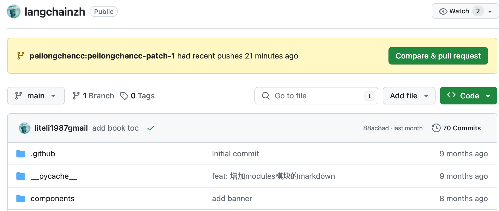

# Github Operate
记录Github的一些常见操作。<br>
- [Github Operate](#github-operate)
  - [将GitHub仓库从公开（public）更改为私人（private）:](#将github仓库从公开public更改为私人private)
  - [如何让朋友可以查看自己的私人仓库:](#如何让朋友可以查看自己的私人仓库)
  - [链接下划线去除：](#链接下划线去除)
  - [github中fork的使用:](#github中fork的使用)
    - [我fork了其他人的github，当原仓库所有者更新代码后，我能同步他的代码吗？](#我fork了其他人的github当原仓库所有者更新代码后我能同步他的代码吗)
    - [拓展--代码推送问题:](#拓展--代码推送问题)
      - [问题描述:](#问题描述)
      - [结果回复:](#结果回复)
  - [很多github项目中有名为`assets`的文件夹，这个文件夹是干什么的？](#很多github项目中有名为assets的文件夹这个文件夹是干什么的)


## 将GitHub仓库从公开（public）更改为私人（private）:

要将GitHub仓库从公开（public）更改为私人（private），请按照以下步骤操作：<br>

1. 登录到你的GitHub账户。

2. 转到你要更改为私人的仓库的页面。

3. 单击仓库名称，进入仓库主页。

4. 单击仓库主页右上角的“Settings”（设置）选项。

5. 在仓库设置页面中，向下滚动，直到找到“Danger Zone”（危险区域）部分。

6. 在“Danger Zone”部分，你会看到“Change repository visibility”（更改仓库可见性）选项。单击它。

7. 在“Change repository visibility”页面上，你需要验证你的GitHub密码以确认你有权限进行此更改。

8. 输入你的GitHub密码并点击“Confirm password”（确认密码）按钮。(如果你使用的google，可以直接用google保存的密码。)


## 如何让朋友可以查看自己的私人仓库:

要让您的朋友能够查看您在GitHub上创建的私人仓库，您需要执行以下步骤：<br>

1. **邀请合作者：** 
   - 打开您的私人仓库页面。
   - 点击页面右上角的 "Settings"（设置）按钮。
   - 在左侧菜单中选择 "Manage access"（管理访问）。
   - 点击 "Invite a collaborator"（邀请合作者）按钮。
   - 在弹出的对话框中输入您朋友的GitHub用户名或其注册的电子邮件地址。
   - 点击 "Add [username/email]"（添加 [用户名/邮箱]）。

2. **接受邀请：** 
   - 您的朋友将收到一封电子邮件通知，说明他们被邀请成为您的仓库合作者。
   - 他们需要点击邮件中的链接并接受邀请。

3. **设置合适的权限：**
   - 您可以选择授予合作者不同级别的访问权限。通常，您的朋友可能需要读取（Read）或者写入（Write）权限，具体取决于您希望他们能够做什么。

4. **访问仓库：**
   - 一旦接受邀请并被授予权限，您的朋友就可以在他们的GitHub账户下找到并访问该私人仓库。

确保您的朋友有一个GitHub账户，并且他们已登录到该账户，以便接受邀请并访问您的私人仓库。<br>


## 链接下划线去除：

默认情况下，GitHub对文本中的链接是标注下划线的，但可通过以下方式去除：<br>

1. 点击右上角头像；

2. 点击"Settings"；

3. 左侧菜单栏点击"Accessibility"；

4. 下拉进度条至"Content"模块；

5. 勾选"Hide link underlines"；


## github中fork的使用:

问题描述:<br>

GitHub上我发现某人的代码有问题，我fork他的仓库并创建一个分支，然后提交我的更改，能提醒作者吗？还是说需要专门联系作者？<br>

解决方案:<br>

在GitHub上，如果你发现某个项目的代码有问题，并且已经fork了仓库、创建了分支并提交了更改，你可以通过创建一个**Pull Request**来通知原仓库的作者你所做的更改。这是GitHub协作的一个常见流程，不需要你专门去联系作者。以下是具体步骤：<br>

1. **推送更改到你的分支**：首先，确保你在你的分支上的更改已经推送到了GitHub。

2. **创建Pull Request**：
   - 在GitHub上，导航到你fork的仓库的页面。
   - 点击“New pull request”按钮。
   - 选择你的分支和原仓库的相关分支（通常是原仓库的主分支）。
   - 填写Pull Request的标题和描述，清晰地说明你所做的更改和为什么这样做。
   - 提交Pull Request。

出现以下界面，需点击 **"Compare & pull request"** ，然后添加自己的描述，再点击 **"create pull request"** :<br>



3. **等待反馈**：提交Pull Request后，原仓库的维护者会收到通知。他们可以查看你的更改，提出反馈或者直接合并你的更改到他们的仓库中。

4. **可能的讨论**：维护者可能会在Pull Request上提出问题或者要求进一步的更改。这通常会在GitHub的Pull Request页面上以评论的形式出现。

通过这种方式，你就可以在不需要直接联系原作者的情况下，向他们提出更改建议，并且促进代码的改进和协作。<br>

### 我fork了其他人的github，当原仓库所有者更新代码后，我能同步他的代码吗？

可以的，如果你fork了其他人的GitHub仓库，当原仓库所有者更新代码后，你可以通过以下方式同步这些更新到你的fork仓库。<br>

fork其他人的仓库后，一个好的做法是保持你的`main`分支的上游分支指向你自己的远程仓库(`origin`)，这样你可以自由地在`main`分支上进行开发和提交，而不影响与原仓库的同步。当你需要同步原仓库(`upstream`)的更新时，你可以使用`git fetch upstream`和`git merge upstream/main`来合并这些更新到你的本地`main`分支，具体步骤如下：<br>

1. **确保`main`分支的上游是你自己的仓库(`origin`)**。这样做允许你在`main`分支上进行开发，提交更改，并将这些更改推送到你的远程仓库。

2. **当你想同步原仓库(`upstream`)的更新时**，首先确保你在`main`分支上：

```bash
git checkout main
```

3. **从原仓库获取最新的更新**：

```bash
git fetch upstream
```

如果你还没有设置当前分支的其他上游分支，可以参考以下方式:<br>

```bash
git remote add upstream git@github.com:shibing624/chatgpt-webui.git
```

`git remote -v`查看的效果如下:<br>

```txt
(base) root@iZ2zea5v77oawjy2qz7c20Z:/data/chatgpt-webui# git remote -v
origin  git@github.com:peilongchencc/chatgpt-webui.git (fetch)
origin  git@github.com:peilongchencc/chatgpt-webui.git (push)
upstream        git@github.com:shibing624/chatgpt-webui.git (fetch)
upstream        git@github.com:shibing624/chatgpt-webui.git (push)
```

4. **将这些更新合并到你的`main`分支**：

```bash
git merge upstream/main
```

如果在合并过程中遇到冲突，你需要手动解决这些冲突，并完成合并操作。<br>

5. **最后，将合并后的更改推送到你自己的远程仓库**：

```bash
git push origin main
```

通过这种方式，你的`main`分支就能保持与原仓库的同步，同时还能将你的个人更改推送到你自己的仓库中。这个流程确保了你能够轻松地获取原仓库的更新，同时还能在自己的分支上进行开发，不会影响到与原仓库的同步操作。<br>

### 拓展--代码推送问题:

#### 问题描述:

使用 `git remote -v` 后终端信息如下：<br>

```txt
(base) root@iZ2zea5v77oawjy2qz7c20Z:/data/chatgpt-webui# git remote -v
origin  git@github.com:peilongchencc/chatgpt-webui.git (fetch)
origin  git@github.com:peilongchencc/chatgpt-webui.git (push)
upstream        git@github.com:shibing624/chatgpt-webui.git (fetch)
upstream        git@github.com:shibing624/chatgpt-webui.git (push)
```

为了避免麻烦，创建了一个 `push_commit_to_git.sh` 文件，文件内容如下:<br>

```bash
git add .
git commit -m "更新代码"
git push
```

如果终端运行 `push_commit_to_git.sh` 文件，代码会提交到 origin 和 upstream ，还是只会提交到 origin？<br>

#### 结果回复:

当你运行 `push_commit_to_git.sh` 脚本时，代码只会提交到 `origin` 远程仓库。Git 的 `push` 操作默认只针对当前分支的默认远程仓库，除非你明确指定要推送到其他远程仓库。在你的脚本中，使用的是 `git push` 命令，而没有指定具体的远程仓库和分支，所以它会遵循 Git 的默认行为，即推送到当前分支关联的远程仓库（通常是 `origin`）。<br>

如果你想将更改同时推送到 `origin` 和 `upstream`，你需要在脚本中明确指定每次推送的目的地。例如：<br>

```bash
git add .
git commit -m "更新代码"
git push origin main # 假设你正在推送到 main 分支
git push upstream main # 同样假设你要推送到 upstream 的 main 分支
```

确保替换 `main` 为你实际要推送的分支名。这样做之后，脚本会先将更改推送到 `origin`，然后推送到 `upstream`。<br>


## 很多github项目中有名为`assets`的文件夹，这个文件夹是干什么的？

在GitHub项目中，名为`assets`的文件夹通常用于存放项目的静态资源。静态资源可以包括但不限于以下内容：<br>

- **图像文件**：项目的图标、截图、示意图等。
- **文档**：一些项目相关的文档或说明书，尽管这些通常放在`docs`文件夹中。
- **样式表**：CSS文件或其他样式定义文件，用于网页项目的外观设计。
- **脚本**：一些客户端脚本文件，如JavaScript，可能用于增强网页或应用的交互性。
- **视频和音频文件**：项目可能包含的媒体文件，用于教学、展示或其他目的。

总的来说，`assets`文件夹是用于存储项目中不直接参与代码运行但对项目支持、展示或文档化很重要的资源。这样做的目的是为了保持项目的组织结构清晰，使得开发者和用户都能容易地找到这些资源。这种组织方式有助于分离逻辑代码和静态内容，便于管理和更新。<br>