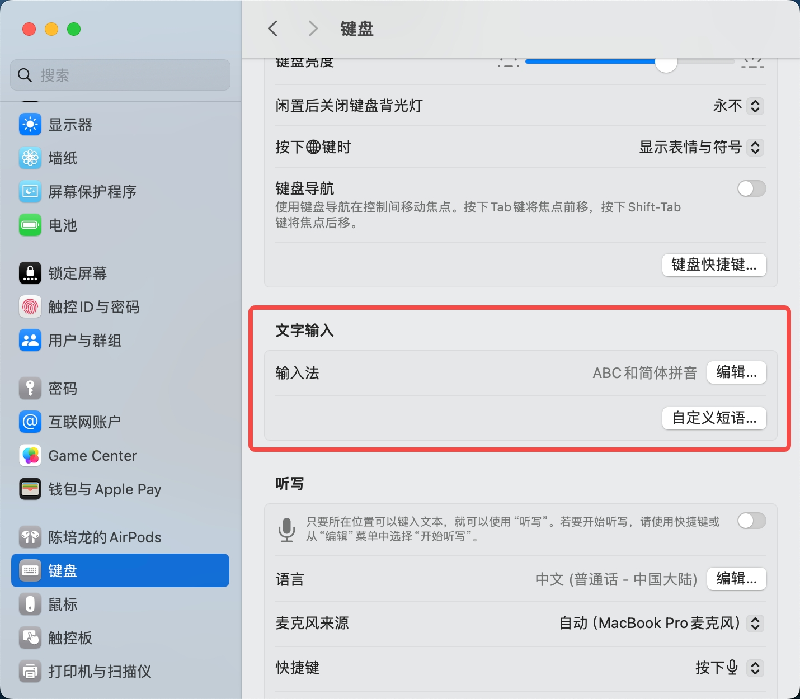

# Mac Command
- [Mac Command](#mac-command)
  - [Mac的劣势：](#mac的劣势)
    - [警醒：](#警醒)
  - [Mac的dmg格式是什么意思：](#mac的dmg格式是什么意思)
  - [Mac通过终端路径打开窗口的方式--open：](#mac通过终端路径打开窗口的方式--open)
  - [Mac打开开发者工具的方式--相当于 win 的 F12：](#mac打开开发者工具的方式--相当于-win-的-f12)
  - [Mac复制文件/文件路径：](#mac复制文件文件路径)
    - [复制文件/文件夹：](#复制文件文件夹)
    - [复制文件路径：](#复制文件路径)
    - [查看当前所在位置路径：](#查看当前所在位置路径)
  - [Mac的强制退出：](#mac的强制退出)
  - [Mac将文件移动至废纸篓:](#mac将文件移动至废纸篓)
  - [brew检查:](#brew检查)
  - [Mac 关闭/开启 SIP(新版mac可用,笔者使用的是Mac M1):](#mac-关闭开启-sip新版mac可用笔者使用的是mac-m1)
    - [查看 SIP 状态](#查看-sip-状态)
    - [关闭或开启 SIP](#关闭或开启-sip)
  - [mac通过触发词输入内容:](#mac通过触发词输入内容)
    - [拓展--我设置好了，浏览器中可以正常触发，但vscode中不能触发，这正常吗？](#拓展--我设置好了浏览器中可以正常触发但vscode中不能触发这正常吗)

## Mac的劣势：

Mac就是有一点不好，对适配要求很高，Mac的系统更新后，会导致某些软件闪退。例如，最近笔者将 Mac 更新到MacOs 14之后打开Navicat(破解版)就会闪退，笔者在之前的系统上可以正常使用的。<br>

笔者只能通过网络搜索，查看最新Navicat安装教程，安装了最新版Navicat(破解版)后，不再闪退，一切正常了～<br>

### 警醒：

每次Mac提醒更新系统时，不要理会，必须要过一段时间，让大家把坑踩了，出了教程才能换新系统，要不然连教程都不知道在哪里找。<br>

## Mac的dmg格式是什么意思：

dmg是Mac机用的一种文件格式，dmg就是disk image的意思，即磁盘影像，相当于windows上的exe。<br>

## Mac通过终端路径打开窗口的方式--open：

在 macOS 终端中，您可以使用以下命令来打开 Finder 窗口并导航到指定的文件或文件夹路径：<br>

```bash
open /path/to/your/folder
```

请将 `/path/to/your/folder` 替换为您想要打开的文件夹的实际路径。例如，如果您要打开名为 "Documents" 的文件夹，您可以使用以下命令：<br>

```bash
open ~/Documents
```

在上面的命令中，`~` 表示当前用户的家目录，然后是 "Documents" 文件夹的路径。<br>

如果您只想在 Finder 中打开当前目录，可以使用以下命令：<br>

```bash
open .
```

在这个命令中，`.` 表示当前目录。<br>

使用 `open` 命令可以方便地从终端打开 Finder 窗口并导航到特定的文件或文件夹。<br>


## Mac打开开发者工具的方式--相当于 win 的 F12：

**"Option + Command + I "** 三个快捷键同时按，最后那个是字母 i 。<br>


## Mac复制文件/文件路径：

### 复制文件/文件夹：

选中文件或文件夹，按快捷键：**"Command + c"**。找到自己想要粘贴的位置，按快捷键：**"Command + v"** 即可。<br>


### 复制文件路径：

选中文件或文件夹，按快捷键：**"option + Command + c"**，即可把路径复制到剪贴板，在需要使用的地方粘帖（**Command+v**）即可。<br>

### 查看当前所在位置路径：

按住 **"Option"** 键稍作等待即可显示。<br>

## Mac的强制退出：

当程序卡住时，Mac可使用以下方式执行强制退出：<br>

同时按下 **"Option + Command + Esc"** 三个按键，然后选择要关闭的程序，点击 "强制退出" 即可。<br>


## Mac将文件移动至废纸篓:

1. 选中文件；
   
2. 同时按下“Command (⌘) + Backspace（⌫）”键；

3. 在废纸篓中，同时按下“Command (⌘) + Shift + Delete”组合键可以清空废纸篓(慎用🚨)；


## brew检查:

`brew`出问题时，可通过以下指令依次排查问题:<br>

```bash
brew doctor
```

## Mac 关闭/开启 SIP(新版mac可用,笔者使用的是Mac M1):

SIP 是 System Integrity Protection 的简写，译为系统完整性保护。 SIP 是 OS X El Capitan 时开始采用的一项安全技术，目的是为了限制 root 账户对系统的完全控制权，也叫 Rootless 保护机制。<br>

Mac 系统中 SIP 状态默认是开启的，但开启SIP会导致更改系统应用图标、终端操作系统目录文件提示「Operation not permitted」、“xxx”因为出现问题而无法打开。请与开发者联系，以确定“xxx”可以配合Macos版本使用等问题，所以自己是手动关闭SIP的。M<br>

近期更新了系统版本导致该状态重新被打开，在终端运行一些命令时提示 "Operation not permitted" 。<br>

### 查看 SIP 状态

终端输入 `csrutil status` 即可看到 SIP 的状态是 disable 还是 enable 。<br>

### 关闭或开启 SIP 

1. 重启 Mac ，按住 **电源键** 直到屏幕上出现苹果的标志和"正在载入启动选项"再松手；
2. 点击设置，选择账号，输入密码；
3. 在屏幕上方的工具栏找到并打开终端，输入命令 `csrutil disable` ；
4. 关掉终端，重启 Mac ；
5. 重启以后可以在终端中查看状态确认 。

开启 SIP 只需在上面第 2 步命令改为 `csrutil enable` 即可。<br>


## mac通过触发词输入内容:

1. 打开 **"系统设置"**。

2. 点击 **"键盘"** 。

3. 寻找 **"文字输入"** 标签。

4. 点击 **"自定义短语"** 按钮添加一个新的替换规则。



5. 在 **"输入码"** 栏输入一个触发词，在与之对应的 **"短语"** 栏输入你的完整文本。

6. 点击完成。

7. 完成后，每次输入这个缩写并按空格键(或tab)时，文本就会自动替换。

### 拓展--我设置好了，浏览器中可以正常触发，但vscode中不能触发，这正常吗？

是的，这种情况是正常的。macOS 的系统级文本替换功能在某些应用中可能不会正常工作，特别是那些有自己内置文本处理机制的应用，比如 Visual Studio Code (VSCode)。这是因为这些应用可能不使用系统的标准文本输入框架，从而导致系统的文本替换功能无效。<br>