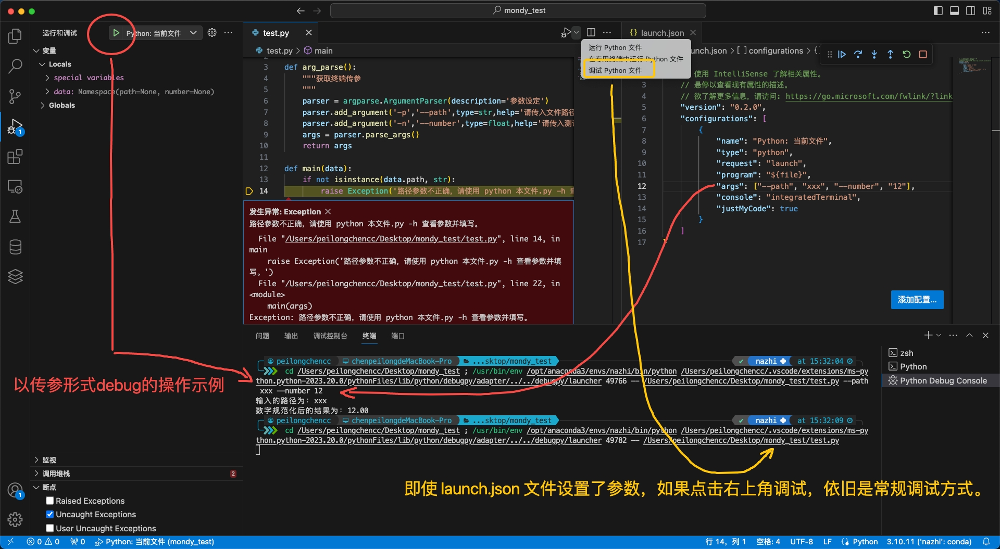

# Argparse

## 代码示例:

```python
# arg_test.py
import argparse

def arg_parse():
    """获取终端传参
    """
    parser = argparse.ArgumentParser(description='参数设定')
    parser.add_argument('-p','--path',type=str,help='请传入文件路径')
    parser.add_argument('-n','--number',type=float,help='请传入测试的数字')
    args = parser.parse_args()
    return args

def main(data):
    if not isinstance(data.path, str):
        raise Exception('路径参数不正确，请使用 python 本文件.py -h 查看参数并填写。')
    print(f'输入的路径为：{data.path}')
    assert isinstance(data.number, float),'数字参数不正确，请使用 python 本文件.py -h 查看参数并填写。'
    print(f'数字规范化后的结果为：{data.number:,.2f}')

if __name__ == "__main__":
    # 参数解析
    args = arg_parse()
    main(args)
```

终端输入:<br>

```bash
python arg_test.py --path='xxx' --number=0.123
```

终端输出:<br>

```txt
输入的路径为：xxx
数字规范化后的结果为：0.12
```

## 使用argparse时的debug方法:

以 VSCode 为例，在 VSCode 中进行带有 `argparse` 的代码调试，你可以按照以下步骤进行：<br>

1. **设置断点**：在 VSCode 中打开你的代码，点击你希望程序暂停的行号左边，设置一个或多个断点。

2. **配置调试环境**：

- 在 VSCode 的侧边栏中点击“运行和调试”图标。
- 点击“创建 launch.json 文件”，选择 Python。
- 在生成的 `launch.json` 文件中，找到或创建一个适用于你的程序的配置段（通常是一个名为 "Python: Current File" 的配置）。

3. **添加命令行参数**：

- 在 `launch.json` 文件的相应配置段中，添加 `"args"` 字段。这个字段应该是一个包含你希望传递给程序的命令行参数的字符串数组。

- 例如，如果你的程序需要两个参数 `--arg1 value1 --arg2 value2`，你的配置可能看起来像这样：

```txt
{
"name": "Python: Current File",
"type": "python",
"request": "launch",
"program": "${file}",
"args": ["--arg1", "value1", "--arg2", "value2"],
...
}
```

具体的操作图如下:<br>

